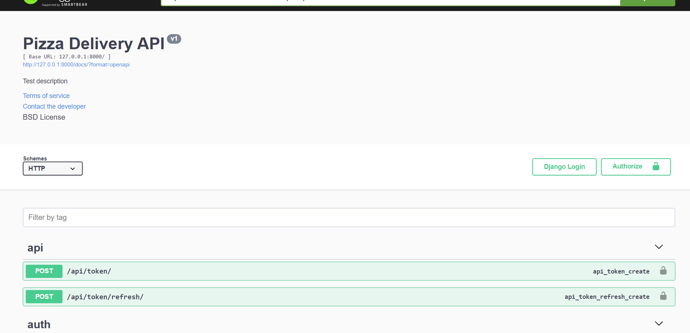
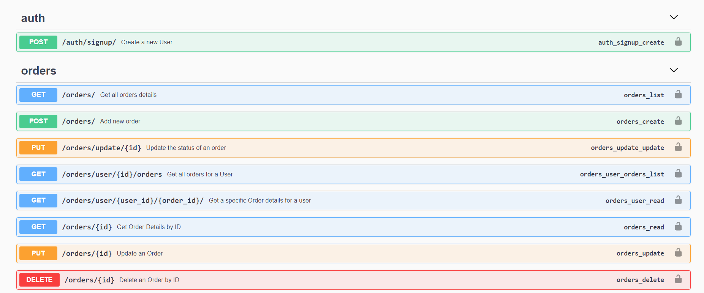

# pizza-delivery-api-Djnago
This project is build using Django Rest framework to create an API for a pizza delivery shop.

### Requirements
For this app to run you need to have **python** installed ( I used python v3.10.5 ).
All the requirements all saved in [requirements.txt](https://github.com/YassineLass/pizza-delivery-api-Djnago/blob/main/requirements.txt) file ( Django included ). So all you need 
to do is to install them by running this command in the project directory
```
pip install -r requirements.txt
```


### .env file
After installing all the requirements you must create a .env file and set the SECRET_KEY and DEBUG variables.  
I used [python-decouple](https://pypi.org/project/python-decouple/) to set up environment variables. That's why you need to add these two variables 

### JSON Web Token Authentication 
I implemented jwt authentication in this api by using the [simple jwt](https://django-rest-framework-simplejwt.readthedocs.io/en/latest/) plugin for Django Rest Framework

### Documentaion
For the documentation there is  Swagger : OpenAPI Documentation Generator for Django REST Framework. So to facilitate the work I used the swagger generator [drf-yasg](https://drf-yasg.readthedocs.io/en/stable/readme.html)
 

